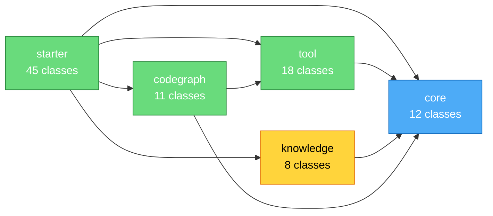

# Module Architecture Tool Design Spec

> Date: 2026-08-04 | Status: Draft | Version: v0.6

## 1. Overview

Add a `ModuleArchitectureTools` that scans the project source tree, generates
module-level dependency diagrams (Mermaid), renders them as interactive HTML,
and stores them as knowledge documents in the VectorStore for RAG retrieval
during diagnosis.

## 2. Problem Statement

During problem diagnosis, the Agent needs **two levels of code understanding**:

| Level | What | Source |
|-------|------|--------|
| **Module level** | "Which module handles replenishment? What does it depend on?" | Knowledge base (RAG) |
| **Method level** | "Who calls `AllocationPlanService.createPlan()`?" | CodeGraph tools |

Currently only the method level exists. The module level requires the user to
mentally map packages to responsibilities. This tool bridges the gap by
pre-generating module architecture diagrams and storing them as searchable
knowledge.

## 3. Architecture

```
┌─────────────────────────────────────────────────────────────────┐
│                    Pre-generation Phase                          │
│                                                                 │
│  Source Tree ──▶ ModuleArchitectureTools                         │
│                     ├── generate_module_arch()                  │
│                     │     └── Scan packages → Mermaid diagram   │
│                     │     └── Write HTML file                   │
│                     └── store_as_knowledge()                    │
│                           └── Save diagram as Document          │
│                           └── Index into VectorStore            │
└─────────────────────────────────────────────────────────────────┘

┌─────────────────────────────────────────────────────────────────┐
│                    Diagnosis Phase                               │
│                                                                 │
│  User: "Why no allocation plan for SKU A123?"                   │
│                                                                 │
│  1. RAG retrieves module architecture doc for "replenishment"   │
│     → Provides module-level context (ReplenishmentModule,       │
│       InventoryModule, AllocationModule)                        │
│                                                                 │
│  2. CodeGraph drills into method-level detail                   │
│     → call_chain, reverse_chain, impact_analysis                │
│                                                                 │
│  3. render_call_graph visualizes the specific call chain        │
│     → Interactive HTML with Mermaid.js                          │
│                                                                 │
│  Result: Architecture diagram + Code evidence + Visualization   │
└─────────────────────────────────────────────────────────────────┘
```

## 4. New Tools

### 4.1 `generate_module_arch`

```
Input:
  - packagePrefix (String, optional): root package to scan
    (default: all packages under project root)
  - depth (int, optional): package depth to analyze (default: 2)

Output:
  - Mermaid diagram text
  - HTML file path
  - Module count, dependency count

Algorithm:
  1. Scan all .java files under project root
  2. Extract package declarations
  3. Group by top N package segments → module names
  4. For each module, collect imports from other modules → dependencies
  5. Generate Mermaid graph LR with module nodes and dependency edges
  6. Write HTML with Mermaid.js rendering
```

### 4.2 `store_as_knowledge`

```
Input:
  - title (String): document title (e.g. "Module Architecture: cn.watsontech")
  - content (String): Mermaid diagram text or summary
  - tags (String, optional): comma-separated tags for retrieval

Output:
  - Confirmation message with document ID

Algorithm:
  1. Create Document with title, content, source="module-architecture"
  2. Add metadata: tags, generatedAt, packagePrefix
  3. If VectorStore available, add document
  4. If KnowledgeETLPipeline available, also write to knowledge dir as .md
```

## 5. Mermaid Diagram Format



Each node shows:
- Module name (last package segment)
- Class count
- Color-coded by layer (core/biz/infra)

Edges show:
- Import dependencies between modules
- Arrow labels show import count

## 6. File Layout

```
snap-agent-spring-boot-2x-starter/src/main/java/.../codegraph/
├── ModuleArchitectureTools.java   ← NEW: @Tool methods
└── (existing files unchanged)

snap-agent-spring-boot-2x-starter/src/test/java/.../codegraph/
├── ModuleArchitectureToolsTest.java  ← NEW: TDD tests
└── (existing files unchanged)
```

## 7. Configuration

```yaml
snap-agent:
  code-graph:
    enabled: true
    # ... existing config ...
    # Module arch settings (reuses code-graph config)
    # scan-packages already controls which packages to analyze
```

No new configuration properties needed. The tool reuses:
- `code-graph.enabled` — master switch
- `code-graph.scan-packages` — which packages to scan
- `code.path-guard` — project root access

## 8. Knowledge Integration

When `store_as_knowledge` is called:

1. **VectorStore path**: Creates a `Document` and adds it via
   `VectorStore.add(List<Document>)`. The document can then be retrieved
   by `VectorStoreDocumentRetriever` during RAG.

2. **File path**: Also writes a `.md` file to `{knowledge-dir}/module-arch/`
   so the ETL pipeline can re-ingest it on restart.

3. **Metadata**: Each document includes:
   - `source`: "module-architecture"
   - `packagePrefix`: the scanned package prefix
   - `generatedAt`: ISO timestamp
   - `moduleCount`: number of modules found
   - `tags`: user-provided tags

## 9. TDD Spec

### US-1: generate_module_arch

| AC | Given | When | Then |
|----|-------|------|------|
| AC1 | Project with packages `com.test.core`, `com.test.biz` | Call `generate_module_arch("com.test", 2)` | Returns HTML path with 2+ modules |
| AC2 | No project root configured | Call `generate_module_arch` | Returns error message |
| AC3 | Empty project (no .java files) | Call `generate_module_arch` | Returns "no modules found" |

### US-2: store_as_knowledge

| AC | Given | When | Then |
|----|-------|------|------|
| AC4 | VectorStore available | Call `store_as_knowledge(title, content)` | Returns success + document stored |
| AC5 | VectorStore not available | Call `store_as_knowledge` | Returns warning "VectorStore not available" |
| AC6 | Title is null/empty | Call `store_as_knowledge` | Returns error message |

## 10. Dependency on Existing Components

```
ModuleArchitectureTools
├── CodePathGuard (project root access)
├── CodeGraphIndex (existing node/edge data for enrichment)
├── VectorStore (optional, for knowledge storage)
└── KnowledgeETLPipeline (optional, for file-based ingestion)
```

All dependencies are optional except `CodePathGuard`.
